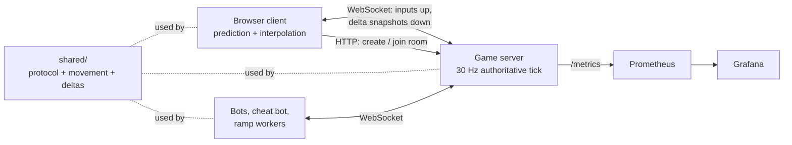

# Tanks Arena: Real-Time Multiplayer Netcode

[](https://github.com/Rishavbhattarai/-multiplayer-arena/actions/workflows/ci.yml)

A browser tank arena built to study multiplayer networking. The server is the only source of truth: clients send key presses, the server simulates at a fixed 30 ticks per second and rejects anything that breaks the rules. Clients predict their own tank, interpolate everyone else, and hits are lag-compensated. Clients and server share one TypeScript movement module. The game uses Canvas rendering and no game engine, so all the netcode is written by hand and covered by tests.

**Stack:** TypeScript (strict), Node.js 22, WebSockets (`ws`), HTML5 Canvas, Vite, Vitest, ESLint, prom-client, Prometheus, Grafana, Docker Compose, GitHub Actions

## Highlights

- Holds 1,680 players on one Node process within the 33 ms tick budget (p99 26.4 ms) on an Apple M4. Profiling shows per-message socket writes, not game logic, are the bottleneck.
- Delta snapshots cut downstream bandwidth per player by 73%, from 24.30 to 6.64 KB/s.
- Under 150 ms RTT, 20 ms jitter and 5% packet loss, client prediction matched the server exactly: 0 corrections in 15 s of driving and firing.
- A cheating client that teleports, floods inputs 10x, smuggles positions and spams fire is rejected and corrected; every rejection is counted by reason in Prometheus.
- A dropped player rejoins within 30 s with the same tank, position and score, including after a page reload.
- The Week 1 naive client stays in the repo for a side-by-side comparison. At 150 ms / 5% loss, remote tanks' 99th-percentile per-frame jump is 29.7 px in the naive client and 4.8 px in the authoritative one.
- 96 tests: protocol codec, deterministic movement, prediction and reconciliation, interpolation, every validation rule, lag compensation, delta encoding, reconnect, and end-to-end tests with real WebSocket clients.

## Architecture



Each tick the server applies validated inputs with the shared `stepTank`, judges shots against where the shooter saw the target, records the state in a 64-tick history, and sends each player only what changed since the snapshot they last acknowledged. [docs/design.md](docs/design.md) covers the protocol and each feature.

| Decision | ADR |
|---|---|
| Raw WebSockets over Socket.IO and WebRTC | [0001](docs/adr/0001-transport-raw-ws-vs-socketio-vs-webrtc.md) |
| 30 Hz tick rate | [0002](docs/adr/0002-tick-rate.md) |
| 100 ms interpolation delay, 200 ms extrapolation cap | [0003](docs/adr/0003-interpolation-delay.md) |
| 300 ms lag-compensation rewind window | [0004](docs/adr/0004-rewind-window.md) |
| JSON with delta snapshots, binary deferred | [0005](docs/adr/0005-encoding.md) |
| Token-bucket input rate limiting | [0006](docs/adr/0006-input-rate-limiting.md) |

## Quickstart

Requires Node 22.12 or later.

```bash
npm install
npm run dev:server     # terminal 1: game server on :8080
npm run dev:client     # terminal 2: client on :5173 (proxies the server)
```

1. Open http://localhost:5173, enter a name and click **Create room**.
2. Open the same URL in a second tab, or join from the room list.
3. W/S moves, A/D turns, the mouse aims, click or Space fires.
4. Add `&lag=150&jitter=20&loss=5` to the URL, or use the **Network simulator** panel, to play under simulated lag.

Add bots to a room you are watching:

```bash
npm run bots -- --room <ROOM_ID> --bots 5 --duration 60
```

With Docker, everything starts with one command:

```bash
docker compose up -d --build --wait
docker compose down
```

| Service | Default port | Override |
|---|---|---|
| Client (nginx, proxies the server) | http://localhost:8081 | `CLIENT_PORT` |
| Game server | http://localhost:8080 | `SERVER_PORT` |
| Prometheus | http://localhost:9090 | `PROMETHEUS_PORT` |
| Grafana, dashboard "Tanks Arena" | http://localhost:3000 | `GRAFANA_PORT` |

[docs/demo.md](docs/demo.md) is a step-by-step script for recording the split-screen comparison and the cheating-client clip.

## Game modes

- **Authoritative** (default for new rooms): the client sends only key inputs. The server simulates, validates and lag-compensates. The client predicts its own tank and interpolates the others.
- **Naive** (`?mode=naive` when creating a room): the Week 1 baseline. The client moves its own tank and sends its position, the server trusts it and relays full snapshots, and other tanks jump to each snapshot. Kept for the side-by-side comparison.
- Joining a room always uses that room's mode. `?server=http://host:port` points the client at a different server.

## HTTP API

| Method | Path | Result |
|---|---|---|
| `GET` | `/healthz` | `{ ok, rooms, players, serverId }` |
| `GET` | `/rooms` | List of rooms |
| `POST` | `/rooms` | Body `{ "mode": "authoritative" \| "naive", "delta": true }`. Returns `201` with the room. |
| `GET` | `/rooms/:id` | Room, or `404` |
| `GET` | `/metrics` | Prometheus metrics |
| `GET` | `/stats` | Tick p50/p99, ticks/s and bytes/s over the last 5 s (used by the load test) |

Rooms hold up to 8 players and close 30 seconds after the last player leaves. The WebSocket endpoint is `ws://host:8080/ws`.

## Development

| Command | What it does |
|---|---|
| `npm run lint` | ESLint with typescript-eslint strict rules |
| `npm run typecheck` | Strict `tsc` across all packages |
| `npm test` | Vitest suite |
| `npm run build` | Production client build |
| `npm run check` | All of the above |
| `npm run bots` | Headless bots ([loadtest/README.md](loadtest/README.md)) |
| `npm run cheat` | Cheating client; exits 0 only if every cheat was blocked |
| `npm run bandwidth` | Bandwidth per player: naive, full, delta |
| `npm run ramp` | Ramp bots until p99 tick time exceeds 33.3 ms |
| `./chaos/drop-connections.sh` | Kill player sockets at random; every player must resume intact |
| `./chaos/pause-server.sh` | Freeze the server container for 5 s while bots play |

CI runs lint, typecheck, tests, build and a bot smoke test, then a second job brings up `docker compose` and runs bots (through the nginx proxy, with reconnects) and the cheating bot against it.

```
shared/         protocol and codec, constants, deterministic movement, delta encoding
server/         HTTP lobby, WebSocket gateway, rooms, tick loop, history, metrics
client/         Vite + Canvas client: prediction, interpolation, network simulator
loadtest/       bots, cheat bot, ramp and bandwidth tests, results/
chaos/          failure-injection scripts
observability/  Prometheus config, Grafana dashboard
docs/           design.md, demo.md, adr/
```

## Roadmap

| Stage | Scope | Status |
|---|---|---|
| 1 | Rooms, WebSocket protocol, fixed tick loop, naive position sync | Done |
| 2 | Input-only clients, server-side movement, input validation against speed, teleport, replay and fire-rate cheats | Done |
| 3 | Client-side prediction, server reconciliation, interpolation, network-condition simulator | Done |
| 4 | Lag compensation, delta snapshots, reconnect within 30 seconds | Done |
| 5 | Bot ramp test, bandwidth comparison, Prometheus and Grafana, ADRs | Done. The split-screen video is not recorded yet ([script](docs/demo.md)). |
| Stretch | Binary encoding, interest management, multiple game servers, replays | Not started |

## Results

**Hardware:** Apple M4 (4 performance + 6 efficiency cores), 16 GB, macOS 26.5, Node 24.11 running natively. Load tests ran on the same machine as the bots, alongside two other projects' Docker stacks, so the host's load average is recorded with each measurement.

### Players per server

`npm run ramp -- --step 80 --workers 2`: 8-player rooms added every 10 s, server tick time measured over the last 5 s of each step. Bots ran in 2 worker processes at up to 53% of a core each, so they were not the bottleneck.

| Players | Tick p50 | Tick p99 | Server CPU | Downstream per player | Host load (1 min) |
|---|---|---|---|---|---|
| 80 | 1.3 ms | 5.4 ms | 10% | 6.55 KB/s | 7.4 |
| 480 | 4.1 ms | 8.0 ms | 25% | 6.65 KB/s | 11.1 |
| 960 | 5.2 ms | 13.0 ms | 33% | 6.59 KB/s | 9.0 |
| 1,440 | 7.3 ms | 17.3 ms | 50% | 6.78 KB/s | 9.4 |
| **1,680** | 9.1 ms | **26.4 ms** | 56% | 6.72 KB/s | 9.1 |
| 1,760 | 14.4 ms | 37.6 ms (over budget) | 73% | 6.78 KB/s | 9.7 |

**1,680 players within the 33.3 ms p99 budget.** Full data: [loadtest/results/ramp-authoritative.json](loadtest/results/ramp-authoritative.json). The same test earlier, while the other projects' load tests had the host at a load average of about 20 to 60, stopped at 560 players ([contended run](loadtest/results/ramp-authoritative-contended.json)).

**Bottleneck:** a CPU profile at 480 players showed 51% of the server's busy time in sending snapshots, with the `writev` syscall alone at 29%. The simulation itself (inputs, movement, hits, diffing) was about 5%. Each snapshot is one WebSocket message per player per tick, so cost grows with message count. Batching writes, a lower snapshot rate than the tick rate, or a native WebSocket server would be the next steps.

### Bandwidth per player

`npm run bandwidth`: 4 rooms x 8 bots, 20 s per variant.

| Variant | Down KB/s per player | Up KB/s per player |
|---|---|---|
| Naive (client positions, full snapshots) | 24.04 | 1.75 |
| Authoritative, full snapshots | 24.30 | 2.22 |
| Authoritative, delta snapshots | **6.64** | 2.22 |

Delta snapshots cut downstream by 73%. 99.8% of snapshots were deltas; none failed to apply.

### Playing at 150 ms RTT, 20 ms jitter, 5% loss

Measured in Chromium (Playwright) with the in-client network simulator, `tcp` loss model (a lost message waits a retransmission timeout and blocks the messages behind it):

| Check | Result |
|---|---|
| Prediction corrections, 15 s driving and firing, no enemies | 0 (largest correction 0 px) |
| Inputs rejected for the honest player, 20 s with 3 bots | 0 of every reason |
| Remote tanks frozen (interpolation buffer empty past the extrapolation cap), 20 s | 0 frames; 391 frames bridged by extrapolation |
| Remote tanks, 99th-percentile jump per rendered frame (8 s, 3 bots) | 4.8 px authoritative, 29.7 px naive |
| Reconnect via "Drop connection", then a page reload | Same player id and identical position both times |

The first version failed this test, which led to three fixes. The simulator reordered messages, causing 314 honest inputs to be rejected as replays. The input burst was too small to absorb a retransmission stall. Remote tanks froze 179 times in 20 s. [ADR 0003](docs/adr/0003-interpolation-delay.md) and [ADR 0006](docs/adr/0006-input-rate-limiting.md) give the details.

### Anti-cheat

`npm run cheat`, 6.3 s against a live server:

| Cheat attempted | Count | Server response |
|---|---|---|
| Teleport (`state` message with a position) | 177 | All rejected (`client_position`); tank never reached the target |
| 10 inputs per tick instead of 1 | 1,770 | 1,568 rejected (`rate_limit`); path 759 units vs 1,194 legitimate max and 11,940 if unthrottled |
| Inputs carrying `x`/`y` fields | 177 | All rejected (`malformed`) |
| Replayed seqs / seq jumps | 177 / 177 | All rejected (`seq_replay` / `seq_jump`) |
| Fire held on every input | 1,770 | 11 shots accepted (max allowed 16) |

Rejections are logged with `player_id` and reason and exported as `tanks_input_rejections_total{reason}`.

### Not measured

- The split-screen video is not recorded yet; [docs/demo.md](docs/demo.md) is the script.
- In-Docker tick timings are not reported: the Docker Desktop VM was shared with other projects' load tests and showed 11 ms p99 ticks with no players.
