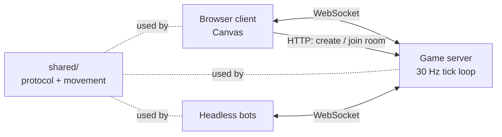

# Tanks Arena: Real-Time Multiplayer Netcode

[](https://github.com/Rishavbhattarai/-multiplayer-arena/actions/workflows/ci.yml)

A browser tank arena built to study multiplayer networking. A Node.js server runs the game at a fixed 30 ticks per second and broadcasts state over WebSockets. Clients and server share one TypeScript movement module. The game uses Canvas rendering and no game engine, so all the netcode is written by hand and covered by tests.

**Stack:** TypeScript (strict), Node.js 22, WebSockets (`ws`), HTML5 Canvas, Vite, Vitest, ESLint, Docker Compose, GitHub Actions

## Highlights

- Runs a fixed-timestep server loop at 30 Hz that catches up after stalls (up to 5 ticks) and reports overruns.
- Shares deterministic movement code between client and server. A test runs 10,000 seeded ticks twice and checks the two runs match step by step.
- Validates every incoming message with a versioned JSON protocol decoder that rejects malformed input.
- Includes headless bot clients for load testing. In a local run, 2 bots each received 30 snapshots per second at about 5.0 KB/s down and 1.75 KB/s up.
- 46 tests: protocol encode and decode, deterministic movement, room join, leave and capacity, tick-loop timing on a fake clock, and an end-to-end test with real WebSocket clients.

## Architecture



[ADR 0001](docs/adr/0001-transport-raw-ws-vs-socketio-vs-webrtc.md) explains the choice of raw WebSockets over Socket.IO and WebRTC. The protocol and room model are in [docs/design.md](docs/design.md).

## Quickstart

Requires Node 22.12 or later.

```bash
npm install
npm run dev:server     # terminal 1: game server on :8080
npm run dev:client     # terminal 2: client on :5173
```

1. Open http://localhost:5173, enter a name and click **Create room**.
2. Open the same URL in a second tab, or join from the room list.
3. W/S or Up/Down moves. A/D or Left/Right turns.

Add bots to a room you are watching:

```bash
npm run bots -- --room <ROOM_ID> --bots 5 --duration 60
```

With Docker, the server runs on :8080 and the client on :8081:

```bash
docker compose up -d --build
docker compose down
```

## Game modes

- `?mode=naive` (current default): the client moves its own tank and sends its position, and the server relays it. This version stays in the repo as the baseline for a side-by-side comparison with the server-authoritative version.
- `?mode=authoritative`: the client sends only key inputs and the server simulates movement. In progress.
- `?server=http://host:port` points the client at a different server.

## HTTP API

| Method | Path | Result |
|---|---|---|
| `GET` | `/healthz` | `{ ok, rooms, players, serverId }` |
| `GET` | `/rooms` | List of rooms |
| `POST` | `/rooms` | Body `{ "mode": "naive" \| "authoritative" }`. Returns `201` with the room. |
| `GET` | `/rooms/:id` | Room, or `404` |

Rooms hold up to 8 players and close 30 seconds after the last player leaves. The WebSocket endpoint is `ws://host:8080/ws`.

## Development

| Command | What it does |
|---|---|
| `npm run lint` | ESLint with typescript-eslint strict rules |
| `npm run typecheck` | Strict `tsc` across all packages |
| `npm test` | Vitest suite |
| `npm run build` | Production client build |
| `npm run check` | All of the above |

```
shared/     protocol types and codec, constants, deterministic movement
server/     HTTP lobby, WebSocket gateway, rooms, tick loop
client/     Vite + Canvas client
loadtest/   headless bots
docs/       design.md, adr/
```

## Roadmap

| Stage | Scope | Status |
|---|---|---|
| 1 | Rooms, WebSocket protocol, fixed tick loop, naive position sync | Done |
| 2 | Input-only clients, server-side movement, input validation against speed and teleport cheats | In progress |
| 3 | Client-side prediction, server reconciliation, interpolation, network-condition simulator | Planned |
| 4 | Lag compensation, delta snapshots, reconnect within 30 seconds | Planned |
| 5 | Bot load test and a side-by-side lag comparison video | Planned |

## Results

Not measured yet. Stage 5 will publish players per server before tick time exceeds its 33 ms budget, bandwidth per player before and after delta snapshots, and playability at 150 ms latency with 5% packet loss.
