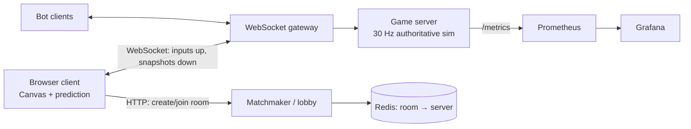

# Project 2: Multiplayer Real-Time Game

**One line:** A browser arena game (top-down tanks or snake battle) where the server is the only source of truth and play still feels smooth at 150 ms latency.
**Target:** 4–5 weeks part-time · **Cost:** $0 · **Build order:** last (optional if time is short)

---

## 1. Goals

- **Server-authoritative** simulation. Clients send inputs only, never positions.
- Smooth feel under lag via **client prediction, reconciliation and interpolation**.
- **Lag compensation** for hit detection.
- Measure players-per-server and bandwidth-per-player, with before/after numbers.

## 2. Non-goals (out of scope)

- Art, sound and polish beyond simple shapes. Gameplay is a vehicle for the netcode.
- Accounts, persistence, leaderboards, payments.
- Mobile/touch controls.
- A game engine (Phaser/Unity). Raw Canvas keeps the netcode visible and yours.

## 3. Stack (all free)

| Layer | Choice | Why |
|-------|--------|-----|
| Language | TypeScript everywhere (monorepo: `shared/`, `server/`, `client/`) | Shared types and physics code between client and server |
| Server | Node 20+ with [`ws`](https://github.com/websockets/ws) | Minimal and explicit. No Socket.IO magic. |
| Client | HTML5 Canvas + Vite | Free, fast dev server |
| Lobby / room map | Redis (Docker) | Room → server mapping |
| Bots | Headless Node scripts using the same `shared/` protocol | Load testing |
| Tests | Vitest | Deterministic sim tests (same inputs give the same state) |
| Metrics | `prom-client` → Prometheus → Grafana | Tick time, bytes/sec, player count |
| CI | GitHub Actions | |

## 4. Architecture



| Component | Responsibility |
|-----------|----------------|
| **Game server** | Fixed tick (30 Hz, 33 ms budget). Applies validated inputs, runs physics and collisions, broadcasts snapshots. |
| **WebSocket gateway** | Connections, rooms, heartbeats/ping, reconnect tokens. Can live in the same process as the game server for the MVP. |
| **Client** | Canvas renderer. Predicts own movement, reconciles with server acks, interpolates other players ~100 ms behind. |
| **Matchmaker / lobby** | Create or join rooms over HTTP. Redis holds the room-to-server mapping. |
| **Bot clients** | Headless scripted players for load tests |

### Protocol sketch

```
client → server: { t: "input", seq, tick, keys, aim }
server → client: { t: "snap", tick, ackSeq, entities: [...delta] }
```

## 5. Features

### Must-have (MVP)
- [ ] Rooms with create/join
- [ ] Fixed-timestep server loop; input-only clients
- [ ] Server validation of every input (max speed, fire cooldowns) to block cheating
- [ ] Client-side prediction with server reconciliation (replay unacknowledged inputs)
- [ ] Entity interpolation for other players
- [ ] Lag compensation: server rewinds state to judge hits at the shooter's view time
- [ ] Delta snapshots: send only what changed since the last acked state
- [ ] Reconnect: a dropped player rejoins within 30 s with state intact
- [ ] Network simulator toggle in the client (added latency, jitter, packet loss)

### Stretch
- [ ] Interest management: send each player only nearby entities
- [ ] Binary protocol (MessagePack or Protobuf) and a bandwidth comparison vs JSON
- [ ] Horizontal scaling: multiple game servers behind the matchmaker
- [ ] Spectator mode and match replays from recorded inputs

## 6. Milestones

| Week | Deliverable | Done when |
|------|-------------|-----------|
| 1 | Rooms, WebSocket protocol, naive server-sent positions | Two browser tabs see each other move. **Record this "naive" version for the demo.** |
| 2 | Fixed tick loop, input-only clients, server validation | Teleport/speed-hack inputs are rejected |
| 3 | Prediction, reconciliation, interpolation, network simulator | Feels smooth at 150 ms simulated latency |
| 4 | Lag compensation, delta snapshots, reconnect | Hits register correctly under lag. Bandwidth drops measurably. |
| 5 | Bot load test, side-by-side lag video, README and ADRs | All success metrics below are published |

## 7. Success metrics

- **Players per server** at 30 Hz before tick time exceeds its 33 ms budget (bots ramp until p99 tick time > 33 ms).
- **Bandwidth per player (KB/s)** before and after delta snapshots (and binary encoding, if done).
- **Playable at 150 ms latency and 5% packet loss**, shown on video.
- **Anti-cheat:** a modified client that sends teleport inputs gets rejected and corrected.

## 8. Demo

Split-screen video: the naive version vs the final version under the same simulated lag, plus a clip of a cheating client being corrected by the server.

## 9. ADR candidates

1. Raw `ws` vs Socket.IO vs WebRTC data channels (TCP head-of-line blocking trade-off)
2. Tick rate (20 vs 30 vs 60 Hz) vs CPU and bandwidth
3. Interpolation delay: smoothness vs added visual latency
4. Lag-compensation rewind window: fairness to the shooter vs "shot behind a wall"
5. JSON vs binary encoding

## 10. Risks

| Risk | Mitigation |
|------|------------|
| Netcode rabbit hole eats the schedule | Timebox lag compensation to 1 week. Ship without it if needed and document it as a stretch. |
| WebSocket runs over TCP, so packet loss causes stalls | Simulate it honestly, show its effect, and discuss WebRTC/UDP in an ADR |
| Non-deterministic physics across client/server | Shared TS physics module and fixed timestep, with Vitest determinism tests |
| Browser `setTimeout` timing is jittery | Use a `requestAnimationFrame` render loop that's separate from the sim tick |

## 11. Free hosting (optional, so people can actually play)

- **Client:** Cloudflare Pages or GitHub Pages (static Vite build).
- **Server:** an Oracle Cloud Always Free VM (best, no sleeping) or a Render free web service (supports WebSockets but cold-starts after idle). Use Cloudflare Tunnel for HTTPS/WSS on the VM.
- Run load tests with bots **locally** and report that hardware.
