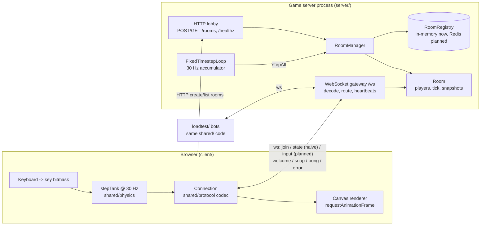

# Design: Multiplayer Real-Time Tank Arena

Status: Week 1 (naive baseline + skeleton). Sections marked *planned* describe where Weeks 2-5 plug in.

## Goals

The server is the only source of truth, and play still feels smooth at 150 ms latency. Week 1 deliberately ships the opposite (a trusting, un-smoothed "naive" mode) so the final demo can show both side by side under identical simulated lag.

## Architecture

### Packages

| Package | Responsibility |
|---|---|
| `shared/` | Constants (`TICK_RATE = 30`), key bitmask, deterministic `stepTank`, protocol types + validating codec. Imported as TypeScript source by everyone, so there is exactly one definition of the rules. |
| `server/` | `http.ts` lobby, `gateway.ts` sockets, `room.ts` per-room state + tick, `roomManager.ts` lifecycle + registry, `loop.ts` fixed timestep. Rooms receive a `PlayerConnection` interface, not a socket, so they are unit-testable. |
| `client/` | Vite + Canvas 2D. `naiveGame.ts` is the Week 1 client. Mode comes from `?mode=`. |
| `loadtest/` | Headless bots using the same protocol and physics. |

### Tick loop

`FixedTimestepLoop` accumulates real elapsed time and runs whole ticks of `TICK_MS` (33.3 ms). If the process stalls it catches up at most 5 ticks, then drops the backlog and reports an overrun (this becomes a Prometheus counter in Week 5). Each tick: `RoomManager.stepAll()` -> each `Room.step()` advances `tick`, (authoritative mode: applies queued inputs at the YOUR TURN hook), broadcasts a full snapshot, then empty rooms older than 30 s are reaped.

Rendering on the client runs on `requestAnimationFrame`, separate from its own fixed 30 Hz simulation step.

## Protocol (v1, JSON text frames)

| Direction | `t` | Fields | Notes |
|---|---|---|---|
| C->S | `join` | `v, roomId, name` | First frame. Rejected on version mismatch. |
| C->S | `state` | `seq, x, y, angle` | **Naive mode only.** Client-reported position, trusted. |
| C->S | `input` | (to be defined in push 2/3) | Authoritative mode. Inputs only, never positions. |
| C->S | `ping` | `id, ts` | RTT display. |
| S->C | `welcome` | `v, playerId, roomId, mode, tick, tickRate, spawn` | |
| S->C | `snap` | `tick, ackSeq, entities[]` | Every tick, full state today; deltas in Week 4. |
| S->C | `pong` | `id, ts, serverTick` | |
| S->C | `error` | `code, message` | `BAD_MESSAGE`, `ROOM_NOT_FOUND`, `ROOM_FULL`, `WRONG_MODE`, ... |

`decodeClientMessage` validates every field (finite numbers, non-negative integer seqs, length limits) and copies only known fields; it returns `null` rather than throwing. Max frame size is 4 KB.

Rooms are created over HTTP (`POST /rooms {mode}`), joined over WebSocket.

## Modes

| | `naive` (Week 1, kept for the demo) | `authoritative` (Weeks 2-4) |
|---|---|---|
| Client sends | its own position (`state`) | key bitmask (`input`) |
| Server | stores it verbatim, no checks | applies inputs with `stepTank`, validates |
| Own tank | local sim, no reconciliation | prediction + reconciliation (planned) |
| Other tanks | snap to latest snapshot | interpolated ~100 ms behind (planned) |
| Cheating | teleport works | rejected and corrected (planned) |

Hook points are marked `YOUR TURN (see YOUR_TURN.md, push N/3)` in `shared/src/protocol.ts`, `server/src/room.ts` (`Room.step`, `handleMessage`), `server/src/gateway.ts`, `client/src/naiveGame.ts` and `client/src/main.ts`. Other planned work is marked `TODO(weekN)`.

## Determinism

`stepTank` is a pure function of `(state, keys, dt)`. Results are rounded to 3 decimals after each step so tiny floating-point differences cannot accumulate, and `-0` is normalised to `0`. Vitest checks that 10,000 ticks of seeded random input give identical state on repeated runs and step-by-step. Caveat: `Math.sin/cos` are not guaranteed bit-identical across JS engines; quantization makes divergence unlikely, and reconciliation (Week 3) corrects it anyway.

## Room registry

`RoomRegistry` (`register/lookup/unregister/list`) is async so a Redis implementation can drop in. Only `InMemoryRoomRegistry` exists today; `docker compose --profile redis up` starts Redis for when `RedisRoomRegistry` is added.

## Planned (by week)

- **Week 2:** authoritative input path + validation (see hook in `Room.step`).
- **Week 3:** prediction, reconciliation (`ackSeq` is already sent), interpolation, client network simulator (in `client/src/net.ts`).
- **Week 4:** lag compensation (state history ring buffer per room), delta snapshots, reconnect tokens.
- **Week 5:** prom-client metrics (`onTickTiming` hook in `FixedTimestepLoop`), bot ramp test, results.
