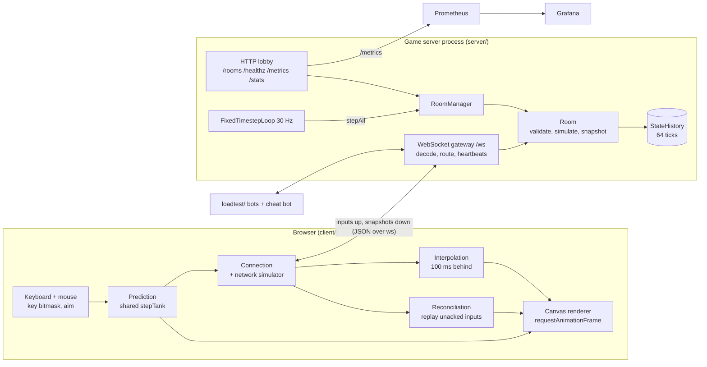

# Design: Tanks Arena

A browser tank arena where the server is the only source of truth. This document covers the architecture, the protocol and how each netcode feature works. Measured results are in the [README](../README.md#results); the trade-offs are in the [ADRs](adr/).

## Architecture

| Package | Responsibility |
|---|---|
| `shared/` | Constants (`TICK_RATE = 30`), key bitmask, deterministic `stepTank`, hitscan geometry, protocol types and validating codec, delta encode/decode (`diffEntities`, `SnapshotStore`). One definition of the rules for client, server and bots. |
| `server/` | `http.ts` lobby, `gateway.ts` sockets, `room.ts` validation + simulation + snapshots, `history.ts` state ring buffer, `loop.ts` fixed timestep, `metrics.ts` Prometheus + `/stats`. Rooms receive a `PlayerConnection` interface, not a socket, so they are unit-tested without the network. |
| `client/` | `authGame.ts` (prediction, reconciliation, interpolation), `naiveGame.ts` (Week 1 baseline), `session.ts` (join, resume, reconnect), `netcode/` (pure, unit-tested modules), `render.ts`. |
| `loadtest/` | `bot.ts` reusable bot, `bots.ts` CLI, `cheat-bot.ts`, `ramp.ts` + `worker.ts` (multi-process ramp), `bandwidth.ts`. |

## Server tick

`FixedTimestepLoop` accumulates elapsed time and runs whole ticks of 33.3 ms. After a stall it runs at most 5 ticks back to back, then drops the rest and counts an overrun (`tanks_tick_overruns_total`). Each tick, per room:

1. Respawn dead tanks whose timer ran out.
2. Per player: add one input credit (capped at `INPUT_BURST`), then apply queued inputs while credit lasts. Each input runs `stepTank` once and may fire.
3. Remove players whose reconnect window (30 s) expired.
4. Record the world state in `StateHistory` (ring buffer, 64 ticks).
5. Send each connected player a full or delta snapshot.

## Protocol (v2, JSON text frames)

| Direction | `t` | Fields | Notes |
|---|---|---|---|
| C->S | `join` | `v, roomId, name, resume?` | First frame. `resume` reattaches a held tank. |
| C->S | `input` | `seq, keys, aim, vt, ack` | Authoritative rooms. `vt` = tick the player was looking at (lag compensation), `ack` = newest snapshot reconstructed (delta baseline). Any `x`, `y`, `pos`, `angle` or `state` field makes the frame invalid. |
| C->S | `state` | `seq, x, y, angle` | Naive rooms only. Rejected as `client_position` in authoritative rooms. |
| C->S | `ping` / `leave` | | RTT display / graceful exit (tank removed now, not held). |
| S->C | `welcome` | `playerId, mode, spawn, resumeToken, resumed, lastSeq, delta, ...` | `spawn` is the current position on resume; the client continues from `lastSeq + 1`. |
| S->C | `snap` | `tick, base?, ackSeq, entities, gone?, ev?` | No `base` = full state. With `base` = only changed fields since that tick. `ev` = shots this tick. |
| S->C | `pong` / `error` | | Error codes include `WRONG_MODE`, `RESUME_FAILED`, `ROOM_FULL`. |

`decodeClientMessage` validates every field (finite numbers, non-negative integer seqs, known key bits, length limits), copies only known fields and returns `null` instead of throwing. Frames are capped at 4 KB.

## Netcode features

### Input-only clients and validation (anti-cheat)

The client sends a key bitmask, an aim angle and a seq. The server checks each input before queueing it and counts every rejection in `tanks_input_rejections_total{reason}`, plus a log line with `player_id` and `reason` (first occurrence, then every 100th):

| Rule | Reason label |
|---|---|
| Position sent by the client (`state` message in an authoritative room) | `client_position` |
| Input frame carrying a position field, or otherwise malformed | `malformed` |
| `seq` not greater than the last accepted seq | `seq_replay` |
| `seq` more than 300 ahead | `seq_jump` |
| Input queue full (15) | `rate_limit` |
| Shot within 15 seqs of the last one, or within 12 server ticks | `fire_cooldown` |

Movement speed is bounded by the token bucket in the tick: one credit per tick, so on average at most one `stepTank` per tick, which is `TANK_SPEED`. The bucket holds 10 credits so an honest client can catch up after a TCP retransmission stall. [ADR 0006](adr/0006-input-rate-limiting.md) explains the numbers.

### Prediction and reconciliation

The client runs `stepTank` on each input as it sends it and keeps the input until a snapshot's `ackSeq` covers it. On each snapshot it takes the server's position, drops acknowledged inputs and replays the rest. Client and server run the same function with the same fixed `dt`, so when nothing unexpected happened the replayed position equals the predicted one and the correction is zero. Corrections under 80 units are blended out over about 100 ms; larger ones (respawn) snap. A dashed outline shows the last server position.

### Interpolation

Remote tanks are drawn 100 ms in the past, between the two snapshots around that time. The server clock is estimated from snapshot arrival times (the least-delayed snapshot in the last second, eased so the render clock never jumps). If the buffer runs dry, tanks continue on their last velocity for up to 200 ms, then hold. See [ADR 0003](adr/0003-interpolation-delay.md).

### Lag compensation

Each input carries `vt`, the tick the client was rendering. When an input fires, the server rewinds every other tank to `vt` (interpolated between two history frames, same as the client draws them), clamped to 300 ms back, and raycasts from the shooter's current position. The rewind depth goes to `tanks_lag_comp_rewind_ticks`. See [ADR 0004](adr/0004-rewind-window.md).

### Delta snapshots

The client returns `ack` (newest snapshot it has fully rebuilt) in every input. The server diffs the current state against that history frame and sends only changed fields, new entities and removed ids. The diff is encoded once per baseline and spliced into each player's message (only `ackSeq` differs). If the baseline is missing on either side, the server sends full state. See [ADR 0005](adr/0005-encoding.md).

### Reconnect

`welcome` carries a random resume token. When a socket closes without `leave`, the tank stays in the room (shown as reconnecting, not hittable) for 30 s. The client retries with backoff (0.5 s to 4 s) and sends `join` with `resume`. The server reattaches the same tank, returns its position and `lastSeq`, and sends a full snapshot next. The token is kept in `sessionStorage`, so a page reload also resumes. A late socket close from the old connection cannot detach the new one, because `disconnect` checks connection identity.

### Network simulator

Every client message in both directions goes through `NetSimChannel` (added RTT, uniform jitter, loss) and an ordered delivery queue. The default `tcp` loss model delays a lost message by a retransmission timeout (at least 200 ms) and blocks everything behind it, which is what TCP does. `drop` discards it instead, for comparison. Settings come from the URL (`?lag=150&jitter=20&loss=5`) or the in-game panel.

## Determinism

`stepTank` is a pure function of `(state, keys, dt)`. Results are rounded to 3 decimals after each step and `-0` is normalised. Tests check 10,000 seeded ticks are identical step by step, that the server's applied inputs equal `simulate(spawn, inputs)`, and that replaying unacknowledged inputs on the acked server state reproduces the client's prediction exactly. `Math.sin`/`cos` are not guaranteed bit-identical across JS engines; rounding makes divergence unlikely and reconciliation corrects it.

## Observability

`GET /metrics` (prom-client): tick duration histogram, overruns, bytes and messages sent by kind (`snap_full`, `snap_delta`, `other`), bytes received, input rejections by reason, shots by result, rewind depth, reconnects, players and rooms, plus Node process metrics (CPU, event-loop lag). `GET /stats` returns exact tick p50/p99 over a rolling 5 s window for the load test. `docker compose up` provisions Prometheus and a Grafana dashboard (`observability/`).

## Known limits

- Game state is in memory. A server crash or restart loses every room; reconnect covers client drops only.
- One process runs every room on one thread. The `RoomRegistry` interface exists for routing rooms across several servers, but only the in-memory implementation is built.
- Tanks pass through each other and there are no obstacles, so "shot behind a wall" from lag compensation cannot happen yet.
